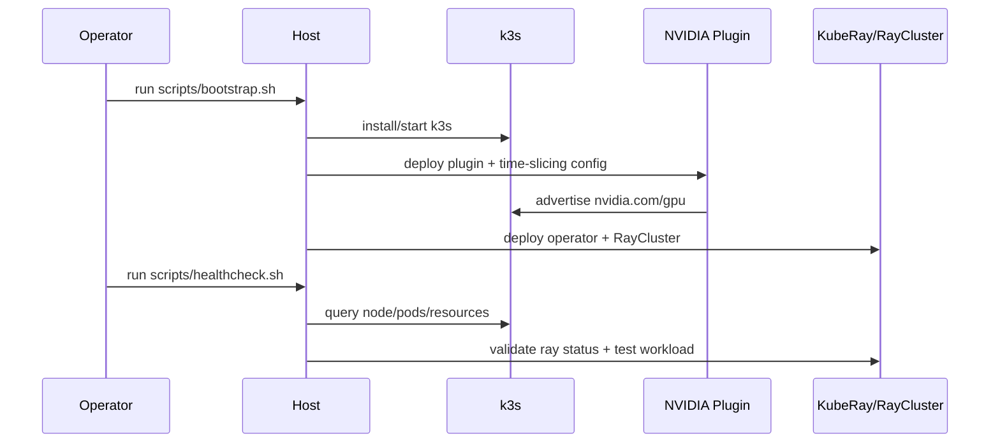

# LocalK8s GPU Ray Platform Design

## Overview
This design implements a deterministic, single-host platform for concurrent GPU workloads using k3s, NVIDIA Kubernetes integration, and one KubeRay-managed RayCluster. The design prioritizes reproducibility and low operational burden over multi-tenant flexibility, and treats bootstrap reruns as reconciliation to the same Day-0 desired state for all project-managed assets.

## Architecture (components, responsibilities, and boundaries)
- Host OS + NVIDIA driver:
  - Owns hardware compatibility and kernel-level GPU support.
- NVIDIA container toolkit:
  - Bridges container runtime to host GPU driver stack.
- k3s (single node):
  - Runs Kubernetes control plane and workloads on one host.
- Ansible host orchestrator:
  - Applies idempotent host configuration for prerequisites, k3s lifecycle, and NVIDIA runtime checks.
- Helmfile release orchestrator:
  - Reconciles Helm releases for NVIDIA device plugin and KubeRay operator from pinned versions.
- NVIDIA device plugin:
  - Publishes schedulable GPU resources to Kubernetes.
- KubeRay operator:
  - Reconciles Ray custom resources.
- RayCluster:
  - CPU-only head service and GPU-enabled worker group.
- Bootstrap reconciler:
  - Applies pinned desired state, emits kubeconfig access helper output, and removes stale project-managed resources/config from earlier runs.

Boundary rule: host-level GPU dependencies must be healthy before cluster-level GPU scheduling and Ray deployment proceed.

## Data Flow (step-by-step; include a Mermaid sequence diagram when useful)
1. Bootstrap script validates host prerequisites.
2. Bootstrap runs Ansible roles to install/verify k3s, configures kubeconfig access, and emits console helper guidance.
3. Bootstrap runs Ansible NVIDIA runtime role and verifies k3s runtime compatibility (`--default-runtime nvidia` or workload `runtimeClassName: nvidia`).
4. Bootstrap runs Helmfile to install/reconcile NVIDIA device plugin with time-slicing config.
5. Node advertises `nvidia.com/gpu` capacity.
6. Bootstrap runs Helmfile to install/reconcile KubeRay operator.
7. Bootstrap reconciles managed Kubernetes manifests (ray namespace, quotas, RayCluster), including prune-scoped stale object cleanup.
8. Healthcheck validates CUDA pod, RayCluster readiness, and benchmark execution.

## Public Interfaces (APIs, CLIs, schemas, config)
- CLI entrypoints:
  - `scripts/setup.sh`
  - `scripts/bootstrap.sh`
  - `scripts/healthcheck.sh`
- Orchestration artifacts:
  - `ansible/site.yml` and `ansible/roles/*` for host/k3s/runtime setup.
  - `helmfile.yaml` and `helm/values/*` for operator/device-plugin releases.
- Bootstrap interface contract:
  - Prints or writes `kubectl` access helper output (for example `KUBECONFIG` export command).
  - Uses non-zero exit status on stage failure.
  - Uses k3s-supported kubeconfig location and options (for example `/etc/rancher/k3s/k3s.yaml` and `--write-kubeconfig` flags).
  - Reconciliation/cleanup is restricted to resources and host paths explicitly marked as project-managed.
- Setup interface contract:
  - Installs and verifies host prerequisites required by bootstrap orchestration.
  - Is safe to rerun and does not remove unrelated host tools/configuration.
- Kubernetes manifests/values:
  - `helm/values/nvidia-device-plugin.yaml` for plugin and time-slicing policy.
  - `helm/values/kuberay-operator.yaml` for KubeRay operator settings.
  - `k8s/managed/*` for namespaces, quotas, and RayCluster reconciliation.
- Version declarations:
  - `config/versions.env` as canonical pin set consumed by scripts.

## Data Model & Storage (including migrations and idempotency)
- Config data:
  - Version pins in `config/versions.env`.
  - Runtime tunables in manifest values (time-slice replicas, Ray worker replicas).
- Storage:
  - Local-path storage class for lightweight PVCs.
  - Host directories for Ray logs and object spill paths.
- Ownership metadata:
  - Managed Kubernetes resources are tagged with an ownership label (for example `app.kubernetes.io/managed-by=localk8s-bootstrap`).
  - Managed host configuration files are maintained in a dedicated manifest/list consumed by bootstrap.
- Idempotency:
  - Scripts must be re-runnable and converge managed assets to Day-0 desired state.
  - Cleanup/removal only targets objects and files marked as project-managed.

## Concurrency, Ordering, and Consistency (if relevant)
- Ordering constraints:
  - GPU host stack -> k3s -> NVIDIA plugin -> KubeRay -> RayCluster -> benchmarks.
- Concurrency controls:
  - Time-slice replicas start low (for example `2` for `nvidia.com/gpu`) and are tuned by benchmark results.
  - Ray tasks/actors must set explicit `num_gpus` to prevent scheduler ambiguity.
  - Validation target is successful workload completion at 1, 2, and 4 concurrent jobs.
- Consistency:
  - A single source of version truth avoids drift between scripts and manifests.

## Failure Modes & Recovery (timeouts, retries, circuit breakers, degraded modes)
- Driver/toolkit mismatch:
  - Detect with containerized `nvidia-smi`; abort downstream stages.
- Helm/chart fetch failures:
  - Retry with bounded attempts; fail with clear diagnostics.
- Plugin healthy but no allocatable GPU:
  - Abort Ray deployment stage and surface node diagnostics.
- Unsupported/incorrect runtime wiring for GPU workloads:
  - Detect missing `nvidia` runtime path (`--default-runtime` or `runtimeClassName`) and fail with explicit remediation.
- Bootstrap access helper missing or invalid:
  - Fail bootstrap stage and emit explicit kubeconfig remediation instructions.
- Cleanup scope mismatch:
  - Abort deletion when resource ownership markers are missing/ambiguous.
- Degraded mode:
  - Allow CPU-only Ray head diagnostics even if worker GPU stage fails.

## Security Model (authn/z, permissions, secrets handling, injection defenses)
- Local-first access model; no external exposure by default.
- Namespace-scoped resources for Ray workloads.
- No plaintext secrets in scripts or manifests.
- Script inputs must be validated to prevent shell injection in future parameterized runs.

## Observability (signals, dashboards, alerts; what you will measure)
- Required health signals:
  - node readiness
  - allocatable GPU state
  - plugin/operator pod readiness
  - RayCluster phase and worker readiness
- Benchmark signals:
  - throughput and latency for 1, 2, and 4 concurrency.
- Artifacts:
  - healthcheck summary output and benchmark result files.

## Rollout Plan (staged rollout, feature flags, backout)
- Stage 1: host GPU preflight and container runtime validation.
- Stage 2: Ansible-driven k3s install/verify, kubeconfig helper output, and baseline cluster checks.
- Stage 3: Ansible NVIDIA runtime verification + Helmfile NVIDIA plugin deployment and GPU visibility checks.
- Stage 4: Helmfile KubeRay operator deploy + managed RayCluster reconciliation.
- Stage 5: validation benchmarks and tuning loop.
- Stage 6: rerun bootstrap and verify Day-0 convergence with no stale project-managed configuration.
- Backout:
  - rollback Helm releases/manifests by stage without forced host wipe.

## Alternatives Considered (at least 2, with pros/cons)
- Alternative A: kubeadm single-node cluster.
  - Pros: closer to full upstream Kubernetes behavior.
  - Cons: heavier setup/maintenance than k3s for local single-host use.
- Alternative B: MIG-first GPU partitioning.
  - Pros: stronger isolation per workload.
  - Cons: hardware-dependent complexity and reduced flexibility for phase 1.
- Alternative C: no GPU sharing (exclusive GPU jobs).
  - Pros: simplest scheduling behavior.
  - Cons: underutilizes GPU for concurrent Ray workloads.

## Open Design Questions
- Should local ingress be introduced now or deferred to phase 2?
- Should concurrency target remain fixed at 4, or scale from GPU count on future multi-GPU hosts?
- Is GPU feature discovery required now, or only when heterogeneous GPU nodes are introduced?

## Verification Strategy (mapping to requirements and test strategy)
- Infrastructure verification:
  - Validate REQ-001 to REQ-004 via node and CUDA checks.
- Platform verification:
  - Validate REQ-005 and REQ-006 via operator and RayCluster readiness.
- Concurrency verification:
  - Validate REQ-007 with controlled workload runs at 1, 2, and 4 concurrent jobs without interactive host debugging.
- Operability verification:
  - Validate REQ-008 to REQ-010 through script reruns, kubeconfig helper output checks, and pin checks.
  - Validate REQ-011 by executing bootstrap multiple times and proving stale managed resources/config are removed.
  - Validate REQ-012 by checking effective GPU runtime path (`--default-runtime nvidia` or `runtimeClassName: nvidia` on GPU workloads).
